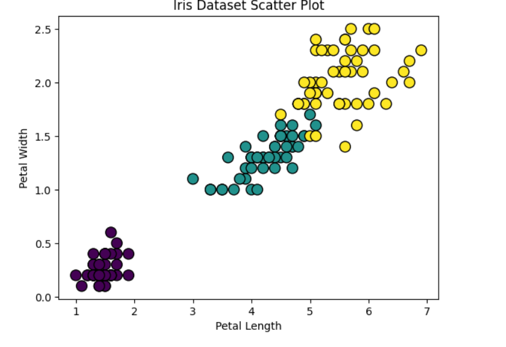

# K-Nearest Neighbors (KNN) Classification on Iris Dataset

## Overview
This project implements the **K-Nearest Neighbors (KNN)** algorithm using the **Iris dataset**.  
KNN is a simple yet powerful **supervised learning algorithm** for classification tasks.  

📘# The Iris dataset has:  
- **150 samples** with 4 features: Sepal Length, Sepal Width, Petal Length, Petal Width  
- **3 species/classes**: Iris-setosa, Iris-versicolor, Iris-virginica  

The goal is to classify iris flowers based on these features.

---

# 🚀 Features  

- Train/Test split on the Iris dataset  
- K-Nearest Neighbors Classifier with configurable **k value**  
- Model training and prediction  
- Accuracy evaluation  
- Visualization of KNN **decision boundaries** and feature relationships  

---

## 📈 Results

**Accuracy:** 1.0  
